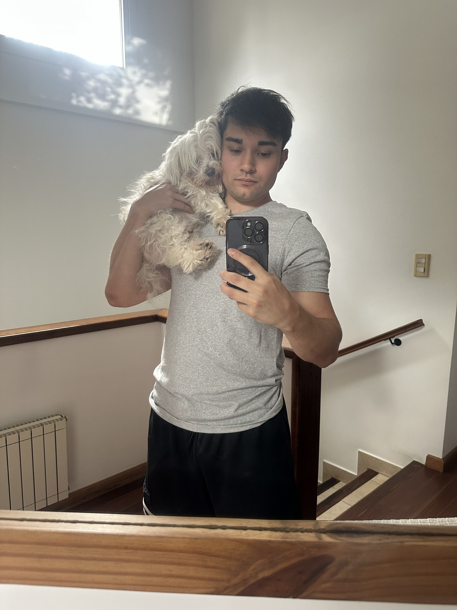

# Bienvenidos!

## Buenas! Me llamo Gonzalo y voy a ser uno de sus ayudantes en esta cursada

Estoy en mi 4to año en la carrera, con mucha suerte el año que viene seria mi 5to y ultimo. En cuanto a PdP, este seria mi 2do año de ayudantia. Mi objetivo para con la materia es que ustedes puedan acercarse a mi como un compañero mas y puedan sacarse todas las dudas que tengan durante la cursada. Esto no solo para que puedan aprender y adentrarse mas en la parte informatica de nuestra carrera, sino tambien para que aprueben y continuen su formacion sin mayor complicacion.

---

### Algunos datos personales mios:

* Vivo parte de la semana en Canning, Esteban Echeverria y otra parte en Balvanera, CABA
* Me gusta ir al gimnasio y salir a correr, juego al futbol y padel ocacionalmente
* Tengo un perro que se llama Lucas
* Me gusta cocinar
* No soy mucho de jugar juegos en la compu, pero si juego cada tanto al minecraft
* Actualmente estoy en busqueda de un laburo relacionado al desarrollo (esta jodida la cosa 😥​)

---

Me copio de Lucho y les paso una foto mia y de mi gordo que me saque recien:

